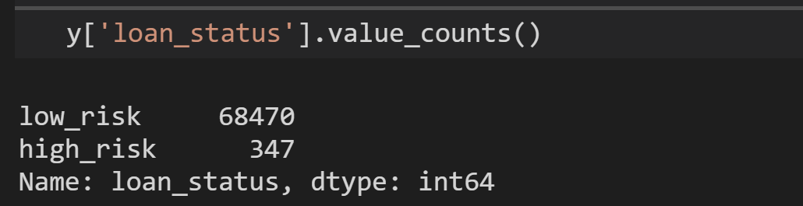
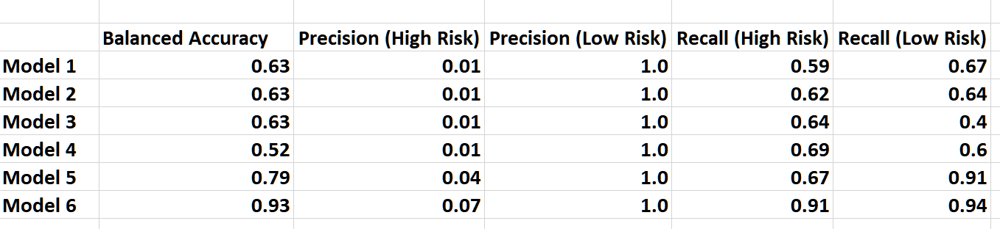

# Credit_Risk_Analysis

## Overview
The purpose of this analysis was to apply machine learning to predict credit risk for a lending services company. 
The models/algorithms that were used to run this analysis are as follows:
- Random Over Sampler (oversampling) 
- Smote (oversampling) 
- Cluster Centroids (under sampling) 
- Smoteen (combinational model of over and under sampling)
- Balanced Random Forest Classifier
- Easy Ensemble Classifier   

## Results: 
Image below is the loan status count of 'low risk' and 'high risk' for this analysis.

Model 1:

Results for the Naive Over Sampling are as follows:
- The balanced accuracy score is 0.63
- The precision score for 
  - high risk is : 0.01
   - low risk is : 1.0
- The recall score for 
  - high risk: .59
  - low risk: .67
     
 Model 2:

Results for the Smote over sampling are as follows:
- The balanced accuracy score is 0.63
- The precision score for 
  - high risk is : 0.01
   - low risk is : 1.0
- The recall score for 
  - high risk: .62
  - low risk: .64
   
Model 3: CLUSTER CENTROIDS

- The balanced accuracy score is 0.63
- The precision score for 
  - high risk is : 0.01
   - low risk is : 1.0
- The recall score for 
  - high risk: .64
  - low risk: .40

Model 4: SMOTEEN

- The balanced accuracy score is 0.52
- The precision score for 
  - high risk is : 0.01
   - low risk is : 1.0
- The recall score for 
  - high risk: .69
  - low risk: .60

Model 5:

- The balanced accuracy score is 0.79
- The precision score for 
  - high risk is : 0.04
   - low risk is : 1.0
- The recall score for 
  - high risk: .67
  - low risk: .91

Model 6:

- The balanced accuracy score is 0.93
- The precision score for 
  - high risk is : 0.07
   - low risk is : 1.0
- The recall score for 
  - high risk: .91
  - low risk: .94

## Summary

In summary 